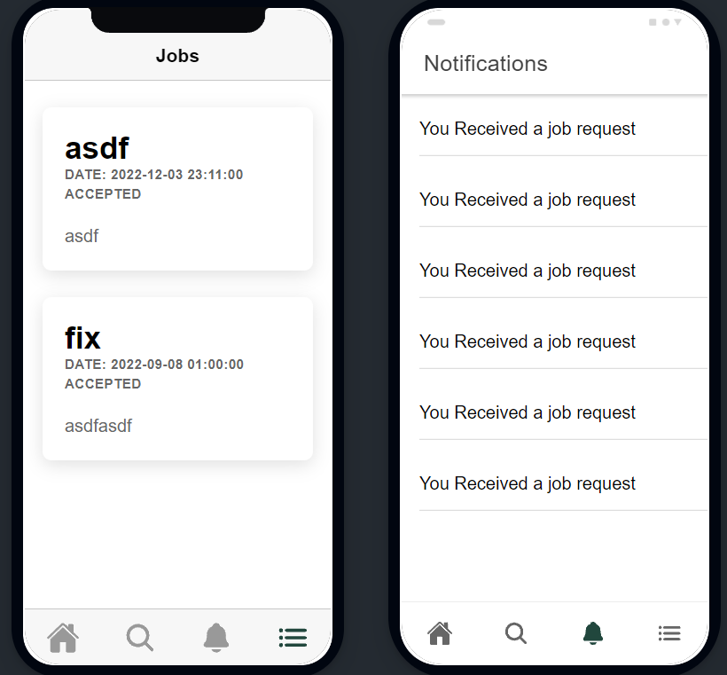
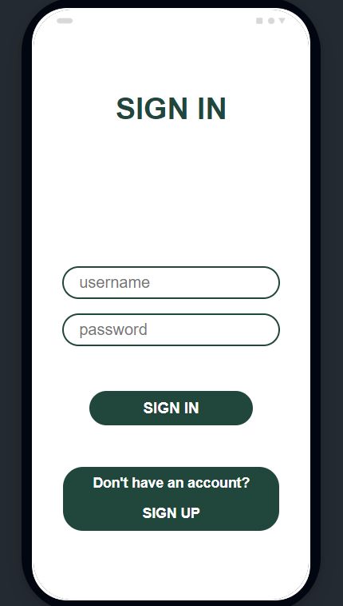
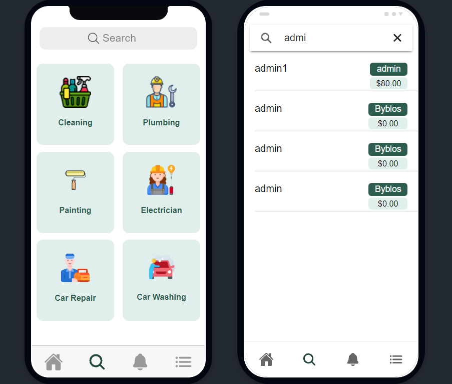

# HandyWork
This app provides users with a comprehensive suite of services to make their lives easier. It offers features such as plumbing, cleaning, car washing, and more.
The app also has a powerful search engine to help users quickly find the sevice providers. Additionally, users can access their personal data anytime,
anywhere, and securely store their information for future use. With this app, users can make sure their lives become easier and on track.

## Stacks

 
 
 

## Getting Started

These instructions will get you a copy of the project up and running on your local machine for development and testing purposes.

### Prerequisites

- ionic
- laravel
- XAMPP

### Setting up the App

- Download and set up XAMPP on your pc.
- Open mysql from XAMPP and create a database called `handyworkdb`
- Open your terminal, navigate to api folder and run `php artisan migrate`
- Open `cmd` navigate to app and run `ionic serve --lab` or `ionic serve`

## Screenshots

